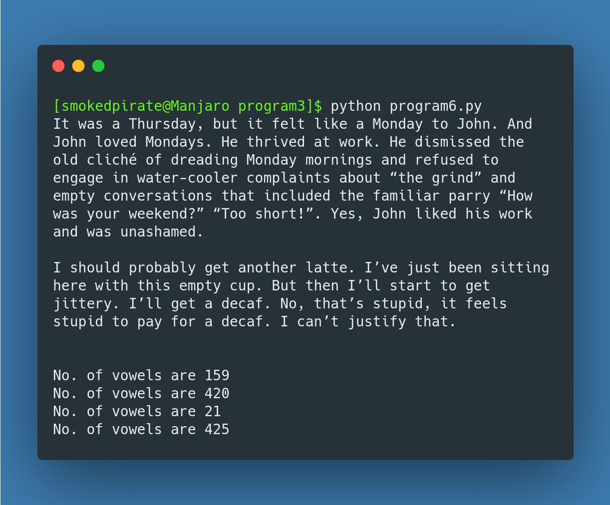

# CS-practical-repo

Author: Hazique sayyed

<h1 align="center">PYTHON</h1>

### Program 1
##### Aim: To write a simple calculator to find sum, diference, product and division 
#### Source code: 
``` python
def add(x, y):
    return x + y

def subtract(x, y):
    return x - y

def multiply(x, y):
    return x * y

def divide(x, y):
    return x / y

print("Select operation.")
print("1.Add")
print("2.Subtract")
print("3.Multiply")
print("4.Divide")

while True:
    choice = input("Enter choice(1/2/3/4): ")
    if choice in ('1', '2', '3', '4'):
        num1 = float(input("Enter first number: "))
        num2 = float(input("Enter second number: "))

        if choice == '1':
            print(num1, "+", num2, "=", add(num1, num2))

        elif choice == '2':
            print(num1, "-", num2, "=", subtract(num1, num2))

        elif choice == '3':
            print(num1, "*", num2, "=", multiply(num1, num2))

        elif choice == '4':
            print(num1, "/", num2, "=", divide(num1, num2))
        break
    else:
        print("Invalid Input")
```
#### Output: 


---
### Program 2
#### AIM: To Write a Python program to read a text file and remove all the lines that contains the character ‘a’ in the file and write it in another file
#### Source code:
```python
oldfile = open('content.txt')
lines = oldfile.readlines()
newopen = open('newfile.txt', 'w')
#print(lines)

for line in lines:
    if 'a' in line:
        #print(line)
        line = line.replace(line, '')
    else:
        newopen.write(line)
newopen.close()
oldfile.close()
print("Contents copied over to newfile.txt")
```
#### Output: 


---

### Program 3
#### AIM: To write a Python program to read a text file line by line and display each word seperated by a #.
#### Source code:
```python
with open('story.txt', 'r') as f:
    for line in f:
        for word in line.split():
            print(word, end="#")
    print('\n')
```

#### Output: 


---
### Program 4
#### AIM: To Write a Python program to read a text file line by line and display the number of vowels/ consonants / upper case letters and lower case characters.
#### Source code:
```python
vowels = ['a','e','i','o','u']
vowels_count = 0
consonat_count = 0
upper_count = 0
lower_count = 0


file = open('story.txt', 'r')
data = file.read()
print(data)
for ch in data:
    if str.isupper(ch):
        upper_count += 1
    elif str.islower(ch):
        lower_count += 1
    ch2 = str.lower(ch)
    if ch2 in vowels:
        vowels_count+=1
    elif ch2 not in vowels:
        consonat_count+=1

print(f"No. of vowels are {vowels_count}")
print(f"No. of vowels are {consonat_count}")
print(f"No. of vowels are {upper_count}")
print(f"No. of vowels are {lower_count}")
file.close()
```

#### Output: 




---
### Program 5
#### AIM: To Write a Python program to create a binary file with roll number , name and marks. Input a roll number and update the marks.
#### Source code:
```python
import pickle
import pprint as pp
import sys

def Display(data):
    data = {}
    file = open("Student.pickle", 'rb')
    try:
        while True:
            Student = pickle.load(file)
            pp.pprint(Student)
    except EOFError:
        file.close()

def Search(data):
    data = {}
    file = open("Student.pickle", 'rb+')
    reader = int(input("Enter the Roll No. to search: "))
    found = False
    try:
        while True:
            data = pickle.load(file)
            if data["Roll"] == reader:
                print("Record Found")
                print(data)
                found = True
                break
    except EOFError:
        if found == False:
            print("Record not found \n \n")
        file.close()

def write_in_file(data):
    data = {}
    studs = int(input("Enter no. of students: "))
    file = open("Student.pickle", "rb+")
    for i in range(1,studs+1):
        data["Roll"] = int(input("Enter the Roll NO: "))
        data["Name"] = input("Enter a name: ")
        data["Marks"] = float(input("Enter the marks: "))
        pickle.dump(data, file)
        print(f"{i} Record(s) Entered Sucessfully")
        data={}
        
    file.close()

def Update_marks(data):
    data = {}
    found = False
    reader = int(input("Enter the Roll No. to update: "))
    file = open("Student.pickle", 'rb+')

    try:
        while True:
            pos = file.tell()
            data = pickle.load(file)
            if data["Roll"] == reader:
                print("Record Found")
                print(data)
                data["Marks"] = float(input("Enter the marks: "))
                file.seek(pos)
                found = True
                pickle.dump(data, file)
                break
    except EOFError:
        if found == False:
            print("Record not found \n \n")
        else:
            print("Marks updated Sucessfully")
        file.close()

    
Sdata = {}

#main program
while True:
    print("Menu \n 1-Write in a file \n 2-display \n 3-Search \n 4-Update Marks \n 5-exit")
    ch = int(input("Enter a Choice: "))
    if ch == 1:
        write_in_file(Sdata)
    if ch == 2:
        Display(Sdata)
    if ch == 3:
        Search(Sdata)
    if ch == 4:
        Update_marks(Sdata)
    if ch == 5:
        sys.exit()

```

#### Output: 


---
### Program 6
#### AIM: To write a Python program to read a text file ( story.txt) line by line and print it.
#### Source code:
``` python
story = "story.txt"
with open(story, "r") as f:
    lines = f.readlines()
    for line in lines:
        print(line)
```

#### Output: 


---
### Connectivity:
#### AIM: To execute an sql query using python
#### Source code:
```python
import mysql.connector as sqltor
connection = sqltor.connect(host="localhost",user="root",password="****!",database='sales')
cursor = connection.cursor()
cursor.execute('Select * from orders where salesman_id=5001')
data = cursor.fetchall()
print (data)
cursor.close()
connection.close()
```

#### Output: 

